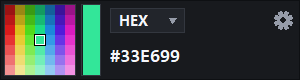
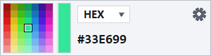
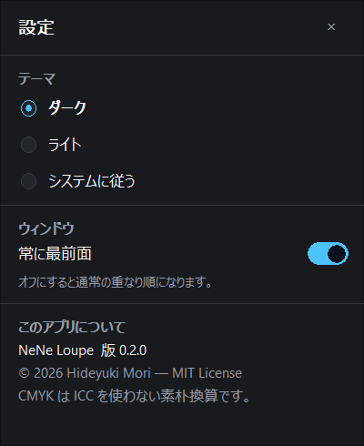
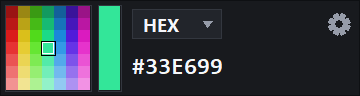

# NeNe Loupe

<p align="center">
  
</p>

A tiny frameless screen loupe and colour picker for Windows. C++ / Win32, no UI library.

## Download and run

NeNe Loupe requires Windows 10 version 2004 or later (x64) with DWM enabled.
Download the ZIP and `SHA256SUMS` from the
[latest release](https://github.com/hideyukiMORI/nene-loupe/releases/latest), verify the ZIP,
extract it, and run `NeNeLoupe.exe`. No installer or additional Visual C++ runtime is required.
The published executable is not code signed, so Windows may show an unknown-publisher warning.
Use `Get-FileHash <downloaded-zip> -Algorithm SHA256` and compare the result with `SHA256SUMS`.

A 240×64 DIP window shows a sharp 8× loupe of the 7×7 pixels directly behind the lens and
the centre colour. Drag the lens or background to move; press Esc or Alt+F4 to close.

## Controls and settings

- Click the value to copy RGB decimal, HEX, CMYK, HSL or HSV text.
- Cycle formats with the label, or choose one from the right-click menu.
- The gear opens theme (dark / light / system), always-on-top, copyright and version.
- Settings apply immediately and persist in `%LOCALAPPDATA%\NeNeLoupe\settings.v1.txt`.

The window is excluded from desktop capture to reveal its backdrop, so it will also be absent
from ordinary screenshots and screen sharing. HDR and ICC colour management are outside the
specification. See [current work](docs/todo/current.md) and
[gate proofs](docs/quality/gate-proofs.md) for measured verification boundaries.

That exclusion is also why no screenshot tool can photograph this application. The pictures in
this README are taken by `python eng/capture-readme-images.py`, which starts it with the
documented diagnostic argument `--allow-screen-capture`, keeps a controlled backdrop over the
loupe so the lens still reads real screen pixels rather than its own window, and photographs the
window with `PrintWindow`. Ordinary runs take no arguments; see
[ADR 0007](docs/adr/0007-photograph-the-loupe-for-the-readme.md).

## Gallery

<p align="center">
  
  
</p>

<p align="center">
  
</p>

Every picture is of the running application on Windows 11. The window is 240×64 DIP and the
settings window 320×392 DIP. At 125% scaling (120 DPI) that is 300×80 and 400×490 pixels; the
last picture is the same window at 150% (144 DPI), 360×96 pixels. This machine has no 100%
display. The lens is magnifying a 7×7 patch of screen pixels the capture script painted behind
it, and the value is the centre pixel of that patch.

## Development

Install the versions in `eng/tool-versions.json` (Visual Studio Build Tools with C++ tools,
LLVM and CMake, plus Python), then run:

```powershell
pwsh -NoProfile -File ./eng/bootstrap.ps1
pwsh -NoProfile -File ./eng/check.ps1
./build/NeNeLoupe.exe
```

After the full gate succeeds, `pwsh -NoProfile -File ./eng/package-release.ps1` creates the
Release x64 portable ZIP and `SHA256SUMS` under `out/release/`.

Bootstrap enables this repository's Git hooks. The full gate builds the application,
runs OS-independent unit tests and enforces 90% core/application branch coverage with LLVM.
Interactive Windows checks are recorded separately in [gate proofs](docs/quality/gate-proofs.md).
The status title exposes the current HEX; capture failures clear stale pixels and show a message.

## Why C++ and plain Win32

This is an experiment repository: the first purpose is to show that a strict, mechanically
enforced rule set can be applied to C++ (the sixth language after Kotlin, Go, Rust, C#, Java).
The tool itself is the second purpose. WinUI 3 was rejected for a widget this small; the reasons
are recorded in [ADR 0002](docs/adr/0002-plain-win32-no-ui-library.md).

## Documents

- [CLAUDE.md](CLAUDE.md) — handbook (Japanese), [AGENTS.md](AGENTS.md) — short entry (English)
- [SPECIFICATION.md](SPECIFICATION.md) — what to build (FR-NNN)
- [docs/](docs/) — constitution, coding rules, quality gates, ADRs

## Licence

MIT
